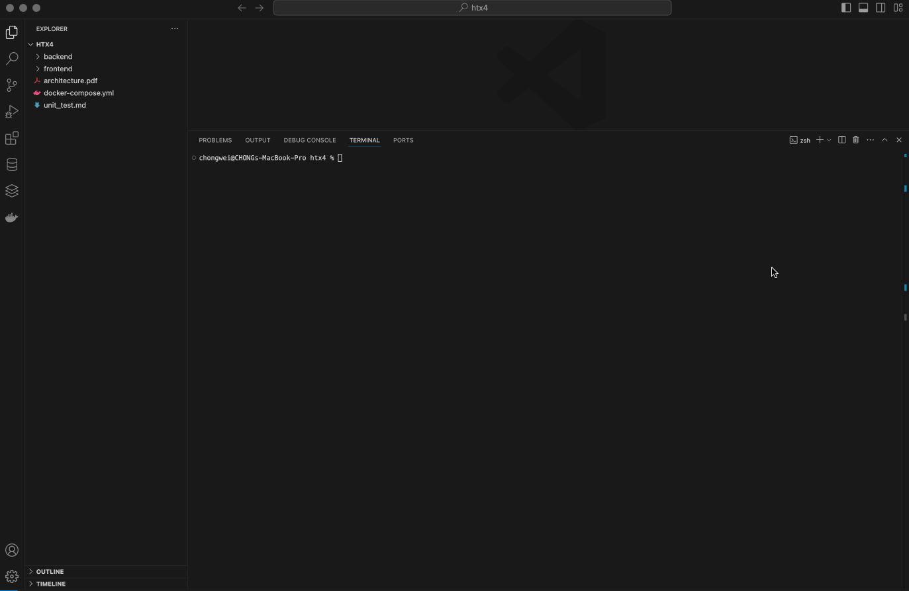

<h2>Full-Stack Application with Audio Transcription and Containerization</h2>

This project focuses on developing a full-stack application with a backend using Python FastAPI and a frontend built with React. It includes functionality for audio transcription through the Whisper speech recognition model (OpenAI/whisper-tiny from Hugging Face) and utilizes SQLite for data storage. Additionally, the project incorporates containerization for deployment.

